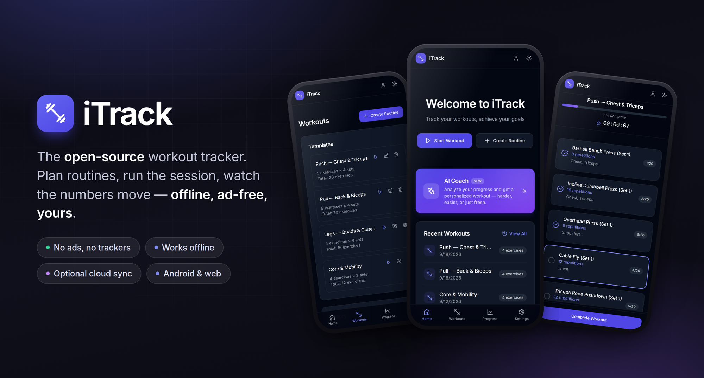
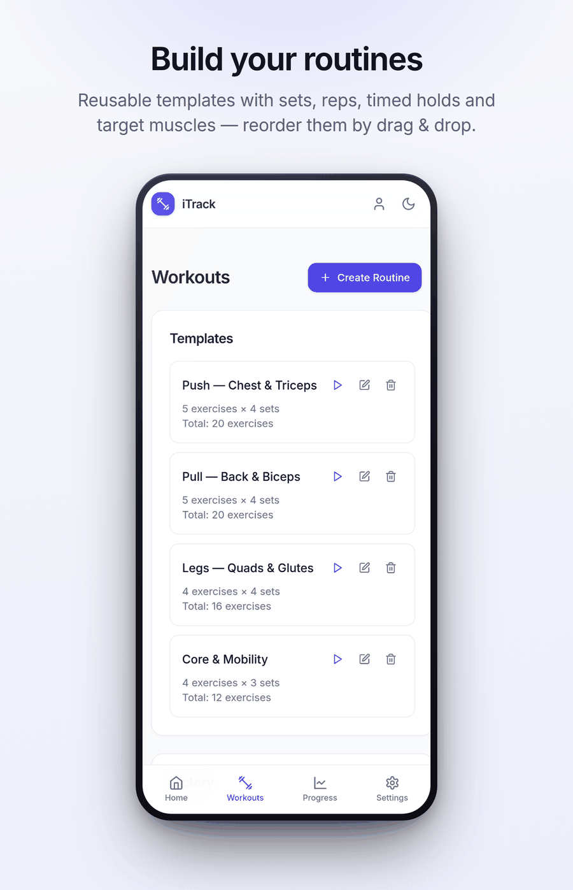
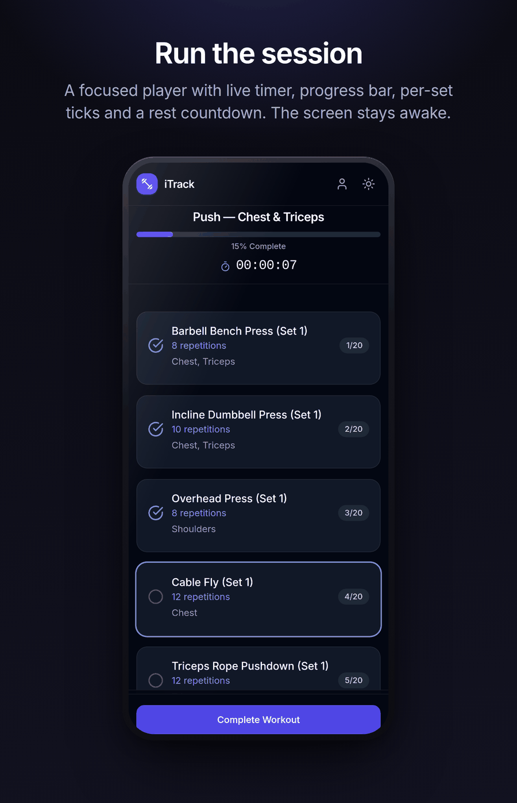
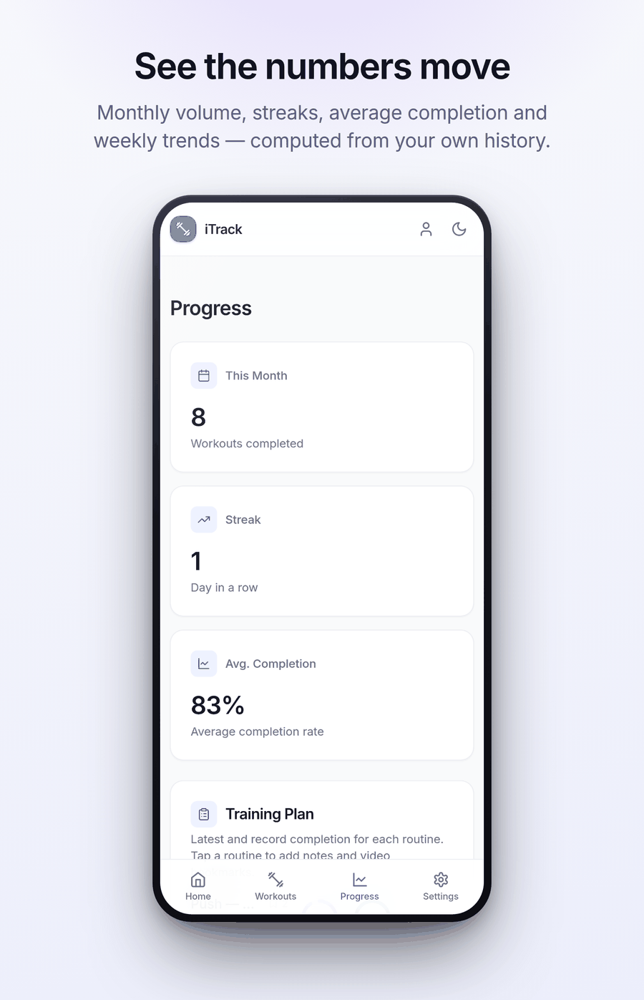
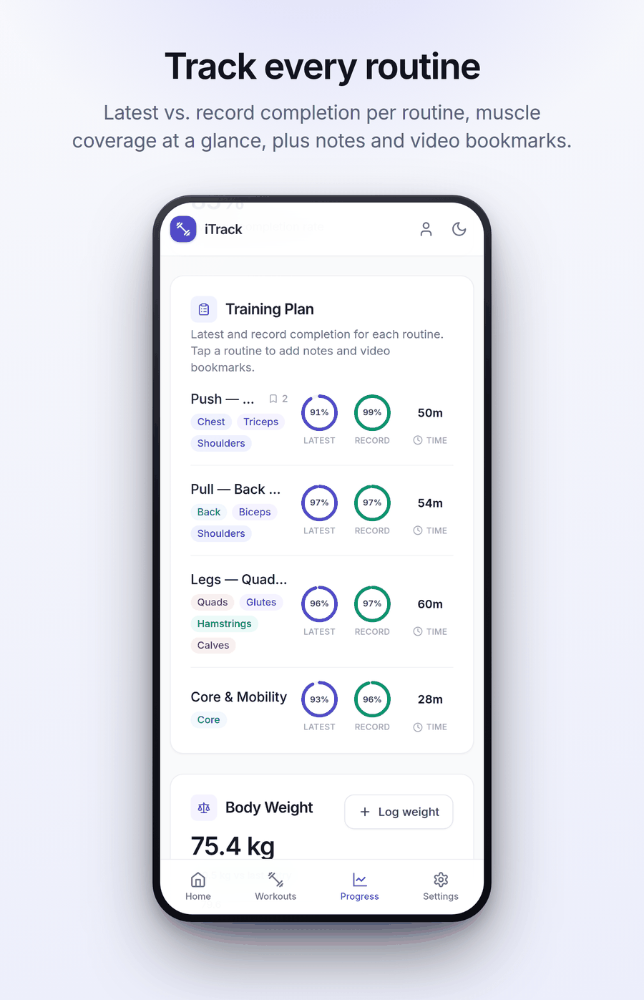
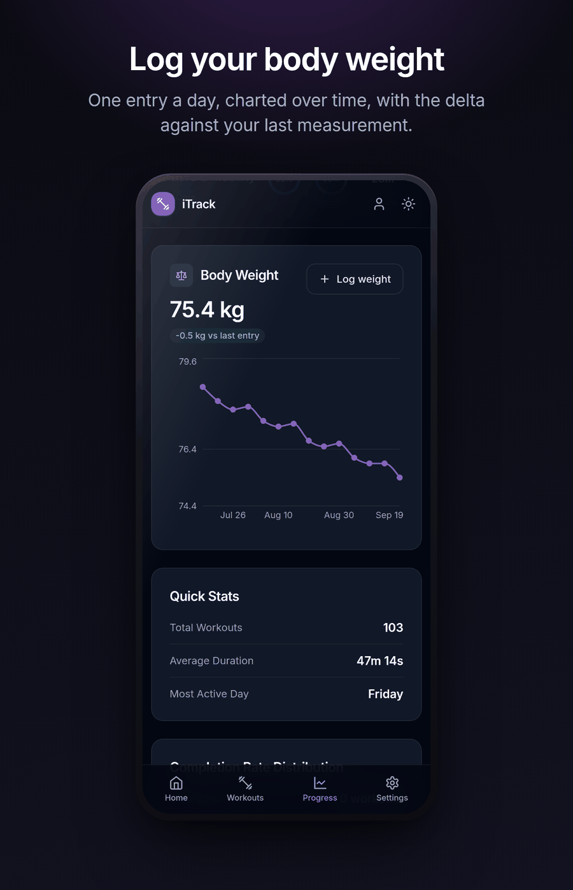
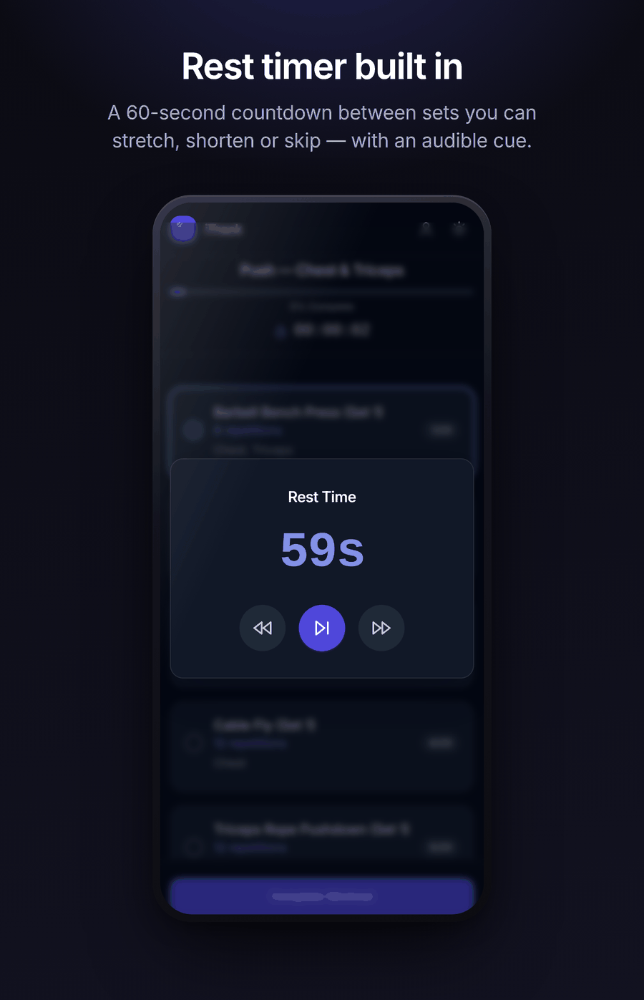
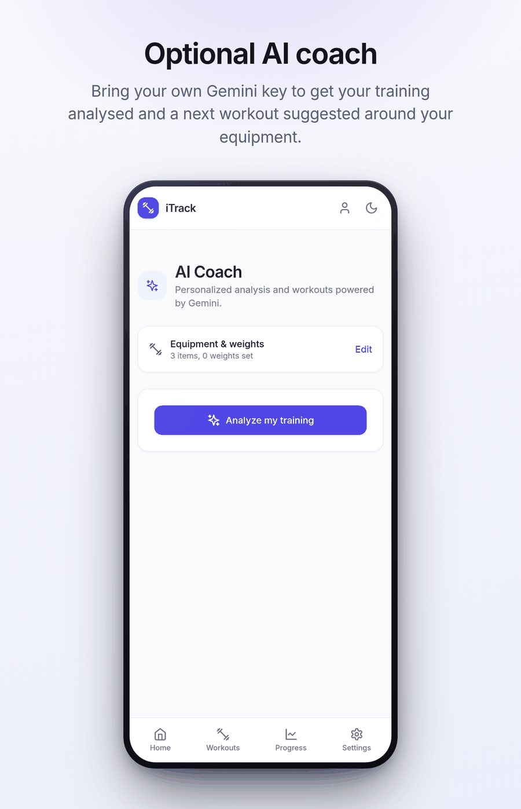
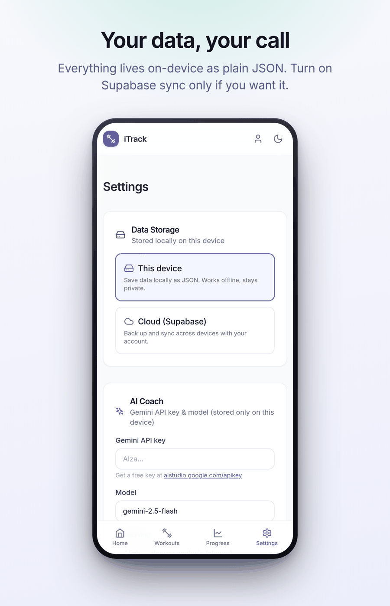
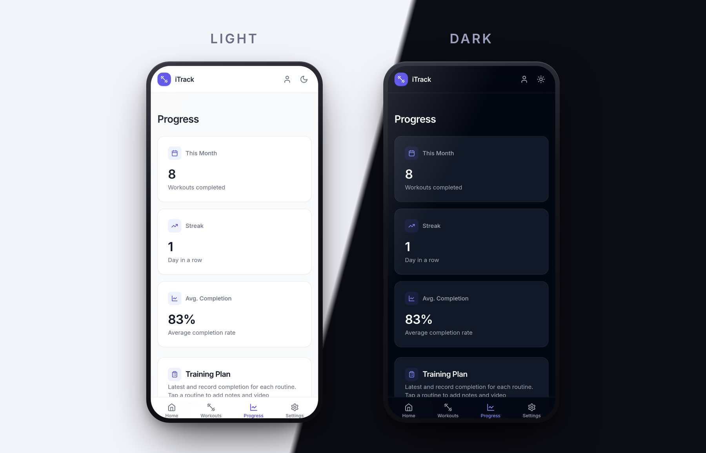

<div align="center">



<br>

<a href="https://f-droid.org/it/packages/com.iTrack.app/">
  
</a>

<br>

[](https://f-droid.org/it/packages/com.iTrack.app/)
[](./LICENSE)
[](https://github.com/xaxoman/iTrack-open-source-workout-app/stargazers)
[](#contributing)

**Plan your routines, run the session, watch the numbers move.**<br>
No ads, no trackers, no account required — your training data stays on your device.

</div>

---

## Features

<table>
<tr>
<td width="50%"></td>
<td width="50%"></td>
</tr>
<tr>
<td width="50%"></td>
<td width="50%"></td>
</tr>
<tr>
<td width="50%"></td>
<td width="50%"></td>
</tr>
<tr>
<td width="50%"></td>
<td width="50%"></td>
</tr>
</table>

### What's inside

| | |
| --- | --- |
| 🏋️ **Routine templates** | Reusable routines with sets, reps, timed holds, target muscles and per-exercise notes. Reorder by drag & drop. |
| ⏱️ **Focused session player** | A checklist grouped by set, a large demo video on the current exercise, timed holds and a rest countdown. Rest sounds ship with the app, so they work offline. The screen stays awake while you train. |
| 🗓️ **History calendar** | Every session on a month calendar. Open one to see what you did, fix its date, duration or ticked exercises, or delete it — stats update right away. |
| 📈 **Progress that means something** | Monthly volume, streaks, average completion, weekly and monthly trends — all computed from your own history. |
| 📋 **Training plan** | Latest vs. record completion for every routine, muscle coverage at a glance, plus notes and video bookmarks per routine. |
| ⚖️ **Body weight log** | One entry a day, charted over time, with the delta against your last measurement — in kg or lb. |
| 🌍 **English & Italiano** | The whole app, dates and numbers follow your language. Translations are welcome! |
| 🔔 **Workout reminders** | Local notifications on the days and at the time you pick. |
| ✨ **Optional AI coach** | Bring your own Gemini key to get your training analysed and a next workout suggested around the equipment you own. |
| 🔒 **Local-first by default** | Everything lives on-device as plain JSON. Export and import it whenever you like. |
| ☁️ **Optional cloud sync** | Connect your own free Supabase project to back up and sync across devices. |
| 🌗 **Light & dark** | Both themes, everywhere, with a one-tap switch. |

<div align="center">

</div>

---

## Install

### Android

<a href="https://f-droid.org/it/packages/com.iTrack.app/">
  
</a>

Available on **[F-Droid](https://f-droid.org/it/packages/com.iTrack.app/)** — free, open source, and built from this repository.

### Web

iTrack is also a PWA: open it in your browser and use **Add to home screen** to install it.

---

## Cloud sync (optional)

By default all data is stored locally on the device — the same JSON that the **Export Data**
button produces. You can optionally sync across devices by connecting your own free
[Supabase](https://supabase.com) project:

1. Create a project at [supabase.com](https://supabase.com).
2. In the Supabase **SQL Editor**, run the script in [`project/supabase/schema.sql`](./project/supabase/schema.sql).
3. Copy `project/.env.example` to `project/.env` and fill in your project URL and anon key
   (found under **Project Settings → API**).
4. Rebuild / restart the dev server.

Once configured, an account icon appears next to the theme switcher. Sign up or sign in,
then choose **Cloud (Supabase)** under **Settings → Data Storage** to back up and sync your
workouts. Without these variables the app runs exactly as before, fully offline.

## AI coach (optional)

The AI Coach analyses your recent training and proposes a next workout. It runs on
**Google Gemini with your own API key**, which is stored only on your device and is never
bundled with the app:

1. Get a free key at [aistudio.google.com/apikey](https://aistudio.google.com/apikey).
2. Paste it under **Settings → AI Coach** (or the first time you open the Coach tab).
3. Optionally list the equipment you own so the suggestions fit your setup.

Leave the key empty and the rest of the app works exactly the same — nothing is sent anywhere.

---

## Getting started (development)

### Prerequisites

- [Node.js](https://nodejs.org/) 18 or newer
- [npm](https://www.npmjs.com/) or [yarn](https://yarnpkg.com/)

### Run it locally

```sh
git clone https://github.com/xaxoman/iTrack-open-source-workout-app.git
cd iTrack-open-source-workout-app/project

npm install
npm run dev
```

### Other commands

```sh
npm run build     # production build -> project/dist
npm run preview   # serve the production build
npm run lint      # ESLint
npx cap sync      # push the web build into the Android project
```

The Android project lives in [`project/android`](./project/android); CI builds a debug APK
via [`.github/workflows/build-apk.yml`](./.github/workflows/build-apk.yml).

### Tech stack

**React 18** · **TypeScript** · **Vite** · **Tailwind CSS** · **Zustand** (state + persistence) ·
**React Router** · **Recharts** · **Lucide** icons · **Capacitor** (Android) · **Supabase** (optional sync)

Architecture notes and conventions live in [`AGENTS.md`](./AGENTS.md).

---

## Contributing

Contributions are welcome:

1. Fork the repository
2. Create a branch (`git checkout -b feature/your-feature-name`)
3. Commit your changes (`git commit -m 'Add some feature'`)
4. Push the branch (`git push origin feature/your-feature-name`)
5. Open a Pull Request

## License

Licensed under the Apache License 2.0 — see [`LICENSE`](./LICENSE) for details.
